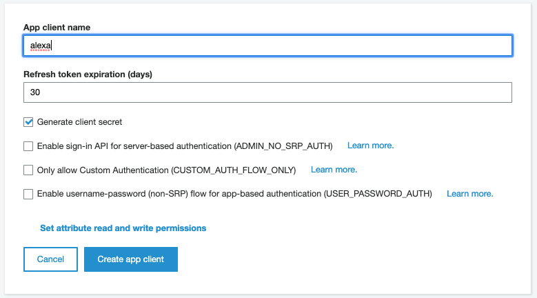

# Create a client in Cognito User Pool

## Create Cognito User Pool

Skip this part if you already have a Cognito User Poool. If you followed 
the [Create a Web Interface to bind Smart Lamp to User](https://github.com/lab798/aws-alexa-workshop-ui),
you should already have one.

1. Open [Amazon Cognito Console](https://console.aws.amazon.com/cognito/home)

1. Choose **Manage User Pools**

1. On the top right corner，choose **Create a user pool**

1. Input a name for your User Pool name，and choose **review defaults*

1. Choose **Attributes** on the left side bar

1. Under How do you want your end users to sign in? select **Email address or phone number**，
and **Allow both email addresses and phone numbers (users can choose one)**

1. At the bottom of the page，select **Next Step** to save the attributes

1. On the left side bar，click **Review**

1. On the Review page, click **Create pool**

## Create a Cognito User Pool Client

If you followed [Create a Web Interface to bind Smart Lamp to User](https://github.com/lab798/aws-alexa-workshop-ui),
you should already have two clients. Let's create one for Alexa.

You can create multiple clients in Cognito User Pool. Usually, a client represents one application, 
no matter it is backend application or frontend application. When integrated with Alexa, the Alexa 
could be considered as a client.

1. On the left navigation bar，select **App clients**

2. Under **App clients**，choose **Add another app client**

3. Enter `alexa` in **App client name** 

4. keep all the rest defaults and click **Create app client**

Next, [Configure Account Linking Settings](./account-linking.md)
