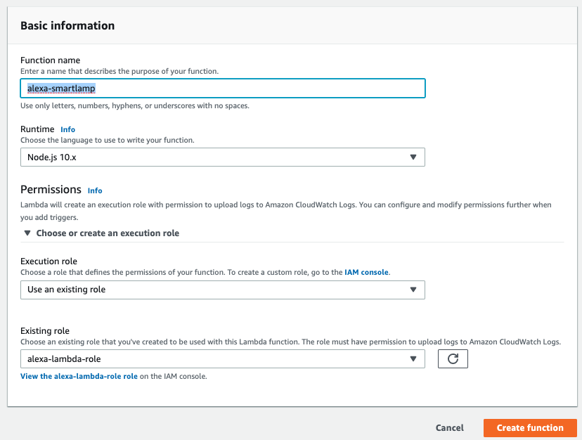
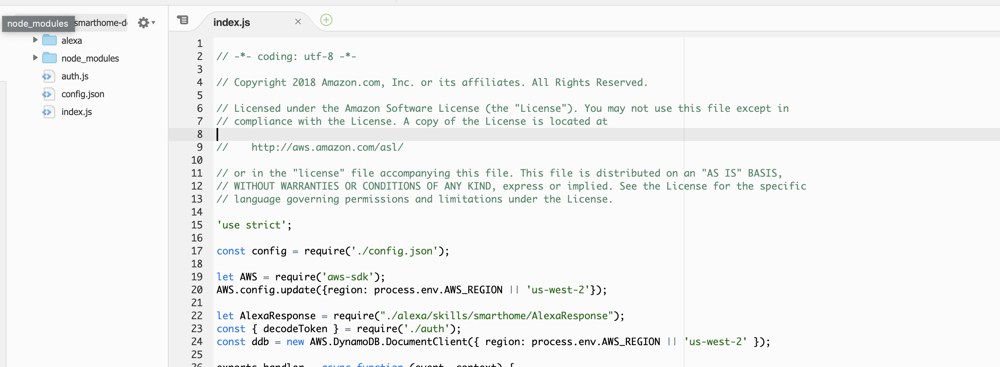

# Create the Alexa backend Lambda

Make sure you've selected the right region
* N.Virginia for English (US) or English (CA) skills
* EU (Ireland) region for English (UK), English (IN), German or French (FR) skills
* US West (Oregon) for Japanese and English (AU) skills.

If you are familiar with [Serverless Framework](https://serverless.com/), you can 
go direct to [Deploy via Serverless Framework](#deploy-via-serverless-framework) 
section. However, it is recommended to follow the manual deployment procedure
for the first time.

## Create Lambda Execution Role

1. Go to IAM Console, click **Create Role**

1. Under Choose the service that will use this role, choose **Lambda**

1. Click **Next: Permissions**, **Next: Tags**, **Next: Review**

1. In the Review page, enter `alexa-lambda-role` for the **Role name**, and choose **Create role**

1. Click the `alexa-lambda-role`, under **Permissions** tab, click **Add inline policy**

1. In Create Policy page, select JSON, and copy & paste the following policy. Please remember to 
replace `<device-table-name>`. Check your DynamoDB table name in DynamoDB 
Console. If you followed [Create a Web Interface to bind Smart Lamp to User](https://github.com/lab798/aws-alexa-workshop-ui),
a DynamoDB table has already been created. This policy grant the Lambda to read items from device table and put logs 
to CloudWatch.

```json
{
    "Version": "2012-10-17",
    "Statement": [
        {
            "Action": [
                "logs:CreateLogStream",
                "logs:PutLogEvents"
            ],
            "Resource": [
                "*"
            ],
            "Effect": "Allow"
        },
        {
            "Action": [
                "dynamodb:Query"
            ],
            "Resource": [
                "arn:aws:dynamodb:*:*:table/<device-table-name>/index/ByUsernameThingName"
            ],
            "Effect": "Allow"
        },
        {
            "Action": [
                "iot:UpdateThingShadow"
            ],
            "Resource": [
                "*"
            ],
            "Effect": "Allow"
        }
    ]
}
```

## Create the Lambda function

1. Go to Lambda Console, click **Create function**

1. Select Author from scratch, and enter the following information:
    - Name: Provide a name for your Lambda function, should be same 
    - Runtime: To use the sample code provided in this topic, choose Node.js 10.x
    - Role: select a role [you previously created](#create-lambda-execution-role)
    

1. Click **Create Function**. Your function should be created and you will move to **Configuration**

1. In the **Configuration** designer, under **Add triggers** select the **Alexa Smart Home trigger**

1. In the **Configure triggers** section, add the **Skill ID** from the developer console in the box specified. 

1. Leave **Enable trigger** checked. This enables the Amazon Alexa service to call your Lambda 
function. If you don't enable it when you create, you will not be able to enable it in the console 
later

1. Click **Add** and then click **Save**

## Upload Code

1. Change directory to `src`

1. Edit `config.json` file, you can find these information in AWS Console and Alexa Console

1. Run `npm install --production` to install dependencies

1. Make a zip file to include `index.js`, `auth.js`, `config.json`, `alexa/` and `node_modules/`,
these files/directories should be located at the root level of the zip file


1. Go to AWS Lambda Console, click the lambda function

1. Under **Function code**, click **Upload** to upload the zip file

## Deploy via Serverless Framework

All of the above settings in this section including Lambda execution role, permission, code, 
Alexa Smart Home SKill can be configured using [Serverless Framework](https://serverless.com/). 
However, you only need to edit `config.json` file and deploy via `sls` command.

1. Edit `config.json` file

1. Run `npm install` to install dependencies including development dependencies

1. Run `sls deploy`

After success deployment, you should be able to see a Lambda named 
`alexa-smarthome-{stage}-backend`.


